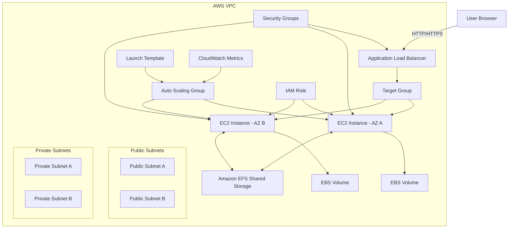

# 🚀 03-EC2-High-Availability

## 📌 Project Overview

This project demonstrates how to design and implement a highly available, scalable, and production-style web application architecture on AWS. Instead of relying on a single EC2 instance, the system is built using multiple components that work together to ensure reliability, fault tolerance, and performance under varying loads. The architecture is designed to remain operational even if one or more servers fail, while also being able to automatically scale based on incoming traffic.

At a high level, user requests are first received by an Application Load Balancer (ALB), which distributes the traffic across multiple EC2 instances running in different Availability Zones. These EC2 instances are managed by an Auto Scaling Group (ASG), which ensures that a minimum number of instances are always running and automatically launches or terminates instances based on demand. This allows the system to handle both low and high traffic efficiently without manual intervention.

To support data consistency across all servers, Amazon EFS is used as shared storage, allowing multiple EC2 instances to access the same files simultaneously. In addition, each EC2 instance uses Amazon EBS for its own instance-level storage, which can be used for operating system data and backups. Snapshots and AMIs are also used to enable recovery and replication of instances when needed.

The entire infrastructure is deployed inside a Virtual Private Cloud (VPC), which is divided into public and private subnets. The public subnets host the load balancer, which is exposed to the internet, while the EC2 instances are placed in private subnets to enhance security by preventing direct public access. Security Groups are used to control traffic flow between components, ensuring that only authorized communication is allowed.

Overall, this project simulates a real-world cloud architecture used in production environments.

## 🎯 Objectives

* Build a **multi-AZ architecture**
* Implement **high availability & fault tolerance**
* Configure **load balancing (ALB)**
* Implement **auto scaling (ASG)**
* Use **EFS for shared storage**
* Use **EBS for instance storage & backups**
* Learn **real production cloud design principles**

## 🔹 Project Evolution

This project was built in phases:

### Phase 1 — Single Instance Setup
- EC2 setup
- Nginx deployment
- EBS and EFS integration
- Load Balancer setup

### Phase 2 — High Availability (In Progress)
- Multi-instance deployment
- Auto Scaling Group (ASG)
- Multi-AZ architecture
- Load balancing across instances

## 🏗️ Architecture Summary

```
User → ALB → Auto Scaling Group → EC2 (Multi-AZ) → EFS / EBS
```

## 🏗️ Architecture Diagram


### 🔹 Main Components

* VPC
* 2 Public Subnets (ALB)
* 2 Private Subnets (EC2)
* Application Load Balancer (ALB)
* Target Group
* Launch Template
* Auto Scaling Group (ASG)
* Amazon EFS (Shared Storage)
* Amazon EBS (Instance Storage)
* Security Groups
* IAM Role
* CloudWatch (Scaling + Monitoring)

## ⚙️ What I Built

This project creates a production-style environment where:

* ALB receives user traffic
* ALB forwards requests to healthy EC2 instances
* EC2 instances are launched using a Launch Template
* ASG maintains minimum running instances
* EFS provides shared storage across all instances
* EBS provides instance-level storage
* Failed instances are automatically replaced
* System scales automatically based on load
* Backups are created using Snapshots and AMIs

## 🧠 Skills Covered

* EC2
* Public vs Private IP
* Elastic IP
* ENI basics
* EBS & Snapshots
* AMI Creation
* EFS
* Load Balancer (ALB)
* Target Groups & Health Checks
* Auto Scaling Groups
* Scaling Policies
* High Availability
* Fault Tolerance
* Backup & Recovery

## 📦 Project Scope

### ✅ In Scope

* Highly available architecture
* ALB + ASG setup
* Multi-AZ EC2 deployment
* EFS shared storage
* EBS + snapshots
* AMI creation
* Scaling policy
* User data automation
* Health checks

## 📁 Recommended Folder Structure

```bash
aws-ec2-high-availability-project/
│
├── README.md
├── architecture/
│   └── architecture-diagram.png
├── scripts/
│   ├── user-data.sh
│   ├── mount-efs.sh
│   └── stress-test.sh
├── screenshots/
│   ├── 01-vpc.png
│   ├── 02-subnets.png
│   ├── 03-security-groups.png
│   ├── 04-efs.png
│   ├── 05-launch-template.png
│   ├── 06-target-group.png
│   ├── 07-alb.png
│   ├── 08-asg.png
│   ├── 09-scaling-policy.png
│   ├── 10-ec2-instances.png
│   ├── 11-website-output.png
│   ├── 12-ebs-volume.png
│   ├── 13-ebs-snapshot.png
│   └── 14-ami.png
└── notes/
    └── troubleshooting.md
```

## 🚀 Deployment Steps (Summary)

## ✅ Step 1 — Networking (VPC Setup)

### 🔹 1. What is a VPC?

A **VPC (Virtual Private Cloud)** is a private network inside AWS where you can launch and manage your resources.

💡 **Simple Explanation:**
- VPC = your own isolated cloud network
- All services like EC2, ALB, and EFS will run inside this network

### 🔧 How to Create a VPC?

#### 📍 Steps:
1. Open AWS Console  
2. Search for **VPC**  
3. Click **Create VPC**

#### Settings:
- Name: `hashmitech-vpc`
- IPv4 CIDR: `10.0.0.0/16`
- DNS settings: Enable DNS resolution & Enable DNS hostnames
- Tenancy: Default

👉 Click **Create VPC**

#### 📸 Screenshot:


### 🔹 2. What is a Subnet?

A **Subnet** is a smaller network inside a VPC.

💡 **Simple Explanation:**
- VPC = entire city  
- Subnet = different areas within the city  

### 🔥 Public vs Private Subnet

| Type            | Description |
|-----------------|------------|
| Public Subnet   | Has direct internet access |
| Private Subnet  | No direct internet access |

💡 **Example:**
- Public Subnet → Load Balancer (ALB)
- Private Subnet → EC2 instances (secure backend)

### 🔧 How to Create Subnets?

#### 📍 Steps:
1. Go to **VPC → Subnets**
2. Click **Create Subnet**

#### 🔹 Public Subnet A
- Name: `public-subnet-a`
- AZ: `eu-west-2a`
- CIDR: `10.0.1.0/24`

#### 🔹 Public Subnet B
- Name: `public-subnet-b`
- AZ: `eu-west-2b`
- CIDR: `10.0.2.0/24`

#### 🔹 Private Subnet A
- Name: `private-subnet-a`
- AZ: `eu-west-2a`
- CIDR: `10.0.11.0/24`

#### 🔹 Private Subnet B
- Name: `private-subnet-b`
- AZ: `eu-west-2b`
- CIDR: `10.0.12.0/24`

#### 📸 Screenshot:


### 🔧 Enable Public IP for Public Subnets

1. Select public subnets  
2. Click **Edit subnet settings**  
3. Enable **Auto-assign public IPv4 address**

❌ Do NOT enable this for private subnets

### 🔹 3. What is an Internet Gateway?

An **Internet Gateway (IGW)** allows your VPC to connect to the internet.

💡 **Simple Explanation:**
- It acts as a gateway between your VPC and the internet

### 🔧 How to Create an Internet Gateway?

1. Go to **VPC → Internet Gateways**
2. Click **Create Internet Gateway**

#### Settings:
- Name: `hashmitech-igw`
👉 Click **Create**

### 🔧 How to Attach IGW to VPC?

1. Select the IGW  
2. Click **Attach to VPC**  
3. Select: `hashmitech-vpc`

#### 📸 Screenshot:


### 🔹 4. What is a Route Table?

A **Route Table** controls how traffic flows within your network.

### 🔥 What is a Public Route Table?

A route table that allows internet access using:
0.0.0.0/0 → Internet Gateway
💡 This means all internet traffic is allowed

### 🔧 How to Create Public Route Table?

1. Go to **VPC → Route Tables**
2. Click **Create Route Table**

#### Settings:
- Name: `public-rt`

#### Add Route:
- Destination: `0.0.0.0/0`
- Target: Internet Gateway

#### Associate Subnets:
- `public-subnet-a`
- `public-subnet-b`

#### 📸 Screenshot:


### 🔹 5. What is a Private Route Table?

A route table that does NOT allow direct internet access.

💡 Used for secure backend resources

### 🔧 How to Create Private Route Table?

1. Create a new route table

#### Settings:
- Name: `private-rt`

#### Associate Subnets:
- `private-subnet-a`
- `private-subnet-b`

❌ We Do NOT add any internet route

#### 📸 Screenshot:


### Final Outcome

After completing this step, Now I have:

- 1 VPC  
- 2 Public Subnets  
- 2 Private Subnets  
- 1 Internet Gateway  
- 1 Public Route Table  
- 1 Private Route Table  

This forms the **network foundation** for a highly available architecture.

## ✅ Step 2 — Security (Security Groups Setup)

In this step, we create **Security Groups** to control traffic between components in our architecture.

Security Groups act as **virtual firewalls** for AWS resources.

### 🔹 What are Security Groups?

A **Security Group** controls inbound and outbound traffic for resources like EC2, ALB, and EFS.

💡 Simple Explanation:
- It defines **who can access what**
- It improves **security and isolation**

## 🔹 1. Create Security Group for ALB

### 📍 Steps:
1. Go to **VPC → Security Groups**
2. Click **Create security group**

### Settings:
- Name: `hashmitech-alb-sg`
- Description: ALB Security Group
- VPC: `hashmitech-vpc`

### Inbound Rules:
| Type  | Protocol | Port | Source     |
|-------|---------|------|------------|
| HTTP  | TCP     | 80   | 0.0.0.0/0  |

👉 This allows users from the internet to access the load balancer

### Outbound Rules:
- Allow all traffic (default)

#### 📸 Screenshot:


## 🔹 2. Create Security Group for EC2

### 📍 Steps:
1. Click **Create security group**

### Settings:
- Name: `hashmitech-ec2-sg`
- Description: EC2 Security Group
- VPC: `hashmitech-vpc`

### Inbound Rules:
| Type  | Protocol | Port | Source               |
|-------|---------|------|----------------------|
| HTTP  | TCP     | 80   | ALB Security Group   |
| SSH   | TCP     | 22   | Your IP (optional)   |

👉 This ensures:
- Only ALB can send traffic to EC2
- SSH access is restricted for admin use

### Outbound Rules:
- Allow all traffic

#### 📸 Screenshot:


## 🔹 3. Create Security Group for EFS

### 📍 Steps:
1. Click **Create security group**

### Settings:
- Name: `hashmitech-efs-sg`
- Description: EFS Security Group
- VPC: `hashmitech-vpc`

### Inbound Rules:
| Type | Protocol | Port | Source            |
|------|---------|------|-------------------|
| NFS  | TCP     | 2049 | EC2 Security Group |

👉 This allows EC2 instances to access shared storage (EFS)

### Outbound Rules:
- Allow all traffic

#### 📸 Screenshot:


### 🎯 Final Outcome

After this step, we will have:

ALB Security Group (public access)
EC2 Security Group (restricted access via ALB)
EFS Security Group (secure internal storage access)

This ensures a secure and controlled communication flow between all components.

- User → ALB (allowed)
- ALB → EC2 (allowed)
- EC2 → EFS (allowed)

❌ Direct user → EC2 (blocked)

## ✅ Step 3 — Storage (EFS + EBS Setup)

In this step, we configure both **shared storage (Amazon EFS)** and **instance-level storage (Amazon EBS)**.

## 🔹 Storage Types Overview

| Storage Type | Description |
|-------------|------------|
| Amazon EFS  | Shared file storage accessible by multiple EC2 instances |
| Amazon EBS  | Block storage attached to a single EC2 instance |

💡 In this project:
- EFS → shared storage across all EC2 instances
- EBS → dedicated storage per instance

## 🔹 Part 1. Create Amazon EFS

### 📍 Steps:
1. Go to **AWS Console → EFS (Elastic File System)**
2. Click **Create file system**

### Settings:
- Name: `hashmitech-efs`
- VPC: `hashmitech-vpc`

👉 Click **Create**

## 🔹 2. Configure Mount Targets

1. Open your EFS
2. Go to **Network tab**
3. Create mount targets in:

- Private Subnet A
- Private Subnet B

👉 Attach Security Group: `hashmitech-efs-sg`


## 🔹 Part 2. Mount EFS on EC2

👉 SSH into your EC2 instance
👉 now we will open our own file system in EC2

### connect EC2 using SSH key in local terminal
```bash
ssh -i .\hashmitech-key.pem ec2-user@35.178.185.17
```


### Install required package:

```bash
sudo yum update -y
sudo yum install -y amazon-efs-utils
```

### create folder
```bash
sudo mkdir -p /var/www/html/shared
```

### Mount EFS
👉 We have to attach/mount karna EFS (Elastic File System) on EC2 instance
👉 A. open EFS
👉 B. copy file system id. i.e. : fs-065d37b5abf8db5d2

```bash
sudo mount -t efs fs-065d37b5abf8db5d2:/ /var/www/html/shared
```

.png)

## 🔹 Part 3. Mount EBS on EC2

### 👉 step A. EC2 → Volumes → Create Volume (hashmi-ebs-volume)
- Settings:
    Size: 8 GB
    Type: gp3
    AZ: SAME as EC2

### 👉 step B. — Mount EBS
- open EC2 instance
- Select Action -> Storage -> Attach volume
- Select EBS volume -> "hashmi-ebs-volume"
- Select Device Name -> "/dev/xvdf"


### 👉 Step C — Check in EC2 terminal
``` bash
lsblk
```


### 👉 Step D. Format EBS
``` bash
sudo mkfs -t ext4 /dev/nvme1n1
```

### - Mount EBS
``` bash
sudo mkdir /data
sudo mount /dev/nvme1n1 /data
```
### - verify

- Data should be visible

``` bash
df -h
```


### ✅ Step 4 — EC2 Setup (Nginx + Dynamic Website)

In this step, we configure our EC2 instances to serve a web application using **Nginx** and display **dynamic instance information**.

### 🔹 A. Install Nginx
```bash
sudo yum update -y
sudo yum install -y nginx
```

### 🔹 B. Start and Enable Nginx
```bash
sudo systemctl start nginx
sudo systemctl enable nginx
sudo systemctl status nginx
```


### 🔹 C. Test Nginx

- Open browser:
- http://YOUR_PUBLIC_IP

👉 You should see Nginx default page

### 🔹 D. Create Dynamic Web Page (Instance Metadata)

In this step, we configure the web server to display **dynamic information** about the EC2 instance, including:

- Instance ID  
- Availability Zone  

This helps verify load balancing later when multiple instances are used.

### 📍 Retrieve Instance Metadata

First, we retrieve metadata from the EC2 instance using the Instance Metadata Service (IMDSv2).

```bash
TOKEN=$(curl -X PUT "http://169.254.169.254/latest/api/token" -H "X-aws-ec2-metadata-token-ttl-seconds: 21600")

INSTANCE_ID=$(curl -H "X-aws-ec2-metadata-token: $TOKEN" -s http://169.254.169.254/latest/meta-data/instance-id)

AZ=$(curl -H "X-aws-ec2-metadata-token: $TOKEN" -s http://169.254.169.254/latest/meta-data/placement/availability-zone)
```

### 📍 Create Custom Web Page

Use the retrieved values to create a custom HTML page:
```bash
echo "<h1>HashmiTech EC2 High Availability Project</h1><p>Instance: $INSTANCE_ID</p><p>AZ: $AZ</p>" | sudo tee /usr/share/nginx/html/index.html
```

### 📍 Restart Nginx
```bash
sudo systemctl restart nginx
```

### 📍 Verify Output
```bash
cat /usr/share/nginx/html/index.html
```
- Open browser:
- http://YOUR_PUBLIC_IP


## ✅  Step 5 — Load Balancer (ALB + Target Group)

In this step, we configure an **Application Load Balancer (ALB)** to distribute incoming traffic across multiple EC2 instances.

## 🔹 What is a Load Balancer?

A **Load Balancer** distributes incoming traffic across multiple servers to ensure:
- High availability  
- Fault tolerance  
- Better performance  

💡 Instead of sending all traffic to one EC2 instance, the ALB distributes requests across multiple instances.

## 🔹 What is a Target Group?

A **Target Group** is a logical group of EC2 instances that receives traffic from the Load Balancer.
- ALB → Target Group → EC2 Instances

## 🔹 A. Create Target Group

### 📍 Steps:
1. Go to **EC2 → Target Groups**
2. Click **Create target group**

### Settings:
- Target type: **Instances**
- Name: `hashmitech-tg`
- Protocol: **HTTP**
- Port: **80**
- VPC: `hashmitech-vpc`

👉 Click **Next**

### Register Targets:
- Select your EC2 instance(s)
- Click **Include as pending below**
- Click **Create target group**

## 🔹 B. Configure Health Check

Edit the Target Group:

### Settings:
- Protocol: HTTP
- Path: `/`
- Healthy threshold: default
- Unhealthy threshold: default

💡 ALB will only send traffic to healthy instances.


## 🔹 C. Create Application Load Balancer (ALB)

### 📍 Steps:
1. Go to **EC2 → Load Balancers**
2. Click **Create Load Balancer**
3. Choose: **Application Load Balancer**

### Basic Configuration:
- Name: `hashmitech-alb`
- Scheme: **Internet-facing**
- IP type: IPv4

### Network Mapping:
- VPC: `hashmitech-vpc`
- Select **Public Subnet A**
- Select **Public Subnet B**

### Security Group:
- Select: `hashmitech-alb-sg`

### Listeners:
- Protocol: HTTP
- Port: 80

### Default Action:
- Forward to: `hashmitech-tg`

👉 Click **Create Load Balancer**


## 🔹 D. Test Load Balancer

After ALB is created:

1. Copy the **DNS name** of the Load Balancer  
2. Open in browser:

```bash 
http://YOUR-ALB-DNS
http://hashmitech-alb-1806645173.eu-west-2.elb.amazonaws.com
```
### 🔹 E. Verify Load Balancing

Refresh the page multiple times.
👉 Currently (Single Instance):
- Same Instance ID will appear on refresh

👉 After adding multiple instances:
- Different Instance IDs will appear
- Different Availability Zones will be visible

💡 This confirms traffic is distributed across multiple EC2 instances.

### 💡 Note:
- The current setup demonstrates the foundational architecture.
- High availability is achieved in the next phase by introducing multiple EC2 instances and Auto Scaling.

## ----------------------------------------------------------

## 🔹 Project Evolution

This project was implemented in phases:

### Phase 1 — Foundation
- VPC, subnets, route tables, IGW
- Security groups
- EFS and EBS setup
- Nginx on EC2
- ALB and target group

### Phase 2 — High Availability
- Launch Template created
- Auto Scaling Group configured across two private subnets
- Desired capacity set to 2, max capacity set to 4
- ALB target group attached to ASG
- Instances automatically registered and deregistered through ASG
- Load balancing verified across multiple Availability Zones

## ----------------------------------------------------------

### ✅ Step 6 — Auto Scaling Group (ASG)

- Goto EC2 Console → Launch Templates → Create launch template.

### Step A. Launch Template
- Launch template name: "hashmitech-lt"
- Template version description: "v1 for HA project"
- AMI: Same as Amazon Linux 2023 used earlier
- Instance type: same as earlier
- Key pair: "hashmitech-key"
- Security Group: "hashmitech-ec2-sg"
- IAM instance profile / role: same role which we used for S3/EFS, if needed.
- Subnet: Don't normally fix subnet in launch template; will choose during ASG

- 👉 Advanced details → User data:

```bash
#!/bin/bash
dnf update -y
dnf install -y nginx amazon-efs-utils

mkdir -p /var/www/html/shared
mount -t efs fs-065d37b5abf8db5d2:/ /var/www/html/shared || true

TOKEN=$(curl -X PUT "http://169.254.169.254/latest/api/token" -H "X-aws-ec2-metadata-token-ttl-seconds: 21600" -s)
INSTANCE_ID=$(curl -H "X-aws-ec2-metadata-token: $TOKEN" -s http://169.254.169.254/latest/meta-data/instance-id)
AZ=$(curl -H "X-aws-ec2-metadata-token: $TOKEN" -s http://169.254.169.254/latest/meta-data/placement/availability-zone)

cat > /usr/share/nginx/html/index.html <<EOF
<h1>HashmiTech EC2 High Availability Project</h1>
<p>Instance: $INSTANCE_ID</p>
<p>AZ: $AZ</p>
<p>Status: Running from Auto Scaling Group</p>
EOF

systemctl enable nginx
systemctl start nginx
```


### Step B. Cretae Auto Scaling Group
- Goto EC2 Console → Auto Scaling Groups → Create Auto Scaling group.

- ASG name `hashmitech-asg`
- Launch template: `hashmitech-lt`
- VPC: `hashmitech-vpc`
- Subnets: `private-subnet-a`, `private-subnet-b`

## 👉 Load balancing
- Attach to an existing load balancer
- Choose existing target group
- Select: `hashmitech-tg`

## 💡 Note:
 According to AWS when we attach ASG to target group, a new instance automatically gets register in targer group.

## 👉 Health checks
- Turn on Elastic Load Balancing health checks
- Health check grace period: 60–120 sec

## 💡 Note:
According to AWS EC2 health checks are there by default, but by turning on ELB health checks, replacing the unhealthy ALB instances becomes possible.

## 👉 Group size
- Desired capacity: 2
- Minimum capacity: 2
- Maximum capacity: 4
## 💡 Note:
- Desired capacity is that number which maintain ASG.

## 👉 Scaling policy

- simplest for now:
- Target tracking scaling policy
- Metric: Average CPU utilization
- Target value: 50%

## 💡 Note:
- Target tracking scaling automatically up/down capacity according to demand.


## Step C. Wait and check the instances
- 👉 Where to check:

- Goto EC2 → Auto Scaling Groups → hashmitech-asg → Activity / Instance management
- 2 instances should be visible.


- 👉 Then:
- Goto EC2 → Target Groups → hashmitech-tg → Targets

- 👉 Expected:
- 2 new ASG instances
- Status: healthy
## 💡 Note:
ALB target groups only give traffic to healthy targets.


## Step C. Remove the old EC2 from target group.

- 👉 When 2 instances from ASG become healthy, then:
- Goto EC2 → Target Groups → hashmitech-tg → Targets

- 👉 Select the old EC2 instance: `Deregister`

 💡 Why?
- SO all the traffic only goes to the ASG managed instances.

## Step D. Verify load balancing

- 👉 Now open browser and do multiple refresh:
- Each time:

- different Instance IDs
- different AZs

- Because now behind the ALB there are multiple healthy instances. this the the job of ALB to distribute traffic between targets.


### Test through terminal:
``` bash
for i in {1..10}; do curl http://hashmitech-alb-1806645173.eu-west-2.elb.amazonaws.com; echo; done
```

## Step E. Auto recovery test

## Test A — instance terminate

- Goto EC2 → Instances
- Select 1 ASG instance select karo → terminate

- 👉 Expected:

- ASG will consider that unhealthy/terminatedand and will launch the replacement.
- desired capacity 2 will be maintained.


## Test B — health check fail

- if in any instance nginx will stop, ALB will mark that unhealthy, and if ELB health checks are enable so it will help in replacement.

### ✅ Step 7 — Scaling Policy

* CPU-based scaling

### ✅ Step 8 — Backup

* Create EBS Snapshot
* Create AMI

### ✅ Step 9 — Testing

* Test load balancing
* Terminate instance → check auto recovery
* Stress test → check scaling

## 📸 Screenshots

📌 Add all screenshots inside `/screenshots` folder and reference here.

## 🧠 Key Learnings

* Real-world AWS architecture design
* Difference between single server vs scalable system
* Importance of multi-AZ deployment
* Load balancing and health checks
* Auto Scaling behavior
* Storage types (EBS vs EFS)
* Backup and recovery strategies

## 🔮 Future Improvements

* Add HTTPS using ACM
* Add custom domain using Route 53
* Implement CloudWatch alarms
* Add SNS notifications
* CI/CD pipeline (CodeDeploy / GitHub Actions)
* Dockerize application
* Terraform automation

## 👨‍💻 Author

**Hamzah Hashmi**
Aspiring DevOps & Cloud Engineer 🚀

