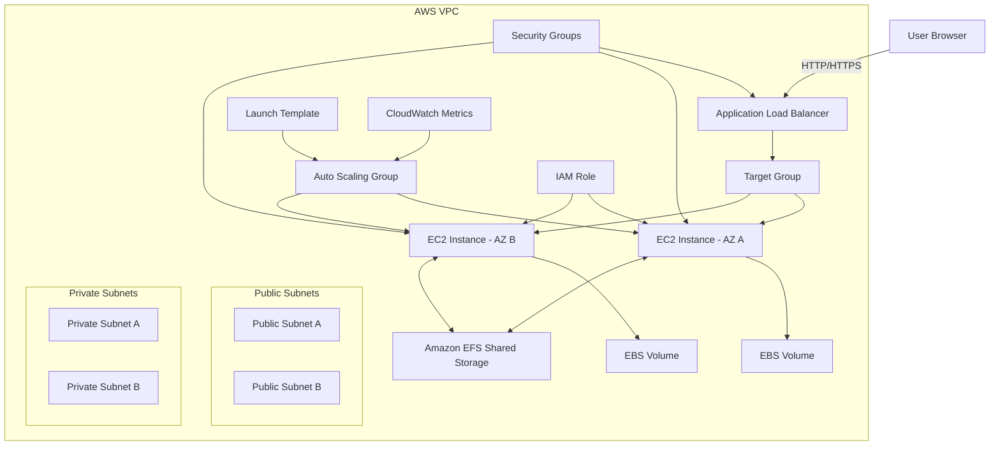

# 🚀 03-EC2-High-Availability

## 📌 Project Overview

This project demonstrates how to build a **highly available, scalable, and production-style web application architecture on AWS** using:

* Amazon EC2
* Application Load Balancer (ALB)
* Auto Scaling Group (ASG)
* Amazon EFS
* Amazon EBS

The goal is to move beyond a **single EC2 instance** and design a system that:

* stays available even if one server fails
* distributes traffic across multiple instances
* automatically scales with load
* shares data between servers
* supports backup and recovery

💡 **In simple terms:**
This project converts a basic EC2 setup into a **real-world production architecture**.

## 🎯 Objectives

* Build a **multi-AZ architecture**
* Implement **high availability & fault tolerance**
* Configure **load balancing (ALB)**
* Implement **auto scaling (ASG)**
* Use **EFS for shared storage**
* Use **EBS for instance storage & backups**
* Learn **real production cloud design principles**

## 🏗️ Architecture Summary

```
User → ALB → Auto Scaling Group → EC2 (Multi-AZ) → EFS / EBS
```

## 🏗️ Architecture Diagram


### 🔹 Main Components

* VPC
* 2 Public Subnets (ALB)
* 2 Private Subnets (EC2)
* Application Load Balancer (ALB)
* Target Group
* Launch Template
* Auto Scaling Group (ASG)
* Amazon EFS (Shared Storage)
* Amazon EBS (Instance Storage)
* Security Groups
* IAM Role
* CloudWatch (Scaling + Monitoring)

## ⚙️ What I Built

This project creates a production-style environment where:

* ALB receives user traffic
* ALB forwards requests to healthy EC2 instances
* EC2 instances are launched using a Launch Template
* ASG maintains minimum running instances
* EFS provides shared storage across all instances
* EBS provides instance-level storage
* Failed instances are automatically replaced
* System scales automatically based on load
* Backups are created using Snapshots and AMIs

## 🧠 Skills Covered

* EC2
* Public vs Private IP
* Elastic IP
* ENI basics
* EBS & Snapshots
* AMI Creation
* EFS
* Load Balancer (ALB)
* Target Groups & Health Checks
* Auto Scaling Groups
* Scaling Policies
* High Availability
* Fault Tolerance
* Backup & Recovery

## 📦 Project Scope

### ✅ In Scope

* Highly available architecture
* ALB + ASG setup
* Multi-AZ EC2 deployment
* EFS shared storage
* EBS + snapshots
* AMI creation
* Scaling policy
* User data automation
* Health checks

## 📁 Recommended Folder Structure

```bash
aws-ec2-high-availability-project/
│
├── README.md
├── architecture/
│   └── architecture-diagram.png
├── scripts/
│   ├── user-data.sh
│   ├── mount-efs.sh
│   └── stress-test.sh
├── screenshots/
│   ├── 01-vpc.png
│   ├── 02-subnets.png
│   ├── 03-security-groups.png
│   ├── 04-efs.png
│   ├── 05-launch-template.png
│   ├── 06-target-group.png
│   ├── 07-alb.png
│   ├── 08-asg.png
│   ├── 09-scaling-policy.png
│   ├── 10-ec2-instances.png
│   ├── 11-website-output.png
│   ├── 12-ebs-volume.png
│   ├── 13-ebs-snapshot.png
│   └── 14-ami.png
└── notes/
    └── troubleshooting.md
```

## 🚀 Deployment Steps (Summary)

### Step 1 — Networking

* Create VPC
* Create Public & Private Subnets
* Attach Internet Gateway
* Configure Route Tables

### Step 2 — Security

* Create Security Groups (ALB, EC2, EFS)

### Step 3 — Storage

* Create EFS and mount on EC2
* Create EBS volume and attach

### Step 4 — EC2 Setup

* Install Nginx
* Configure user-data script

### Step 5 — Load Balancer

* Create Target Group
* Create ALB

### Step 6 — Auto Scaling

* Create Launch Template
* Create ASG (min=2, max=4)

### Step 7 — Scaling Policy

* CPU-based scaling

### Step 8 — Backup

* Create EBS Snapshot
* Create AMI

### Step 9 — Testing

* Test load balancing
* Terminate instance → check auto recovery
* Stress test → check scaling

## 📸 Screenshots

📌 Add all screenshots inside `/screenshots` folder and reference here.

## 🧠 Key Learnings

* Real-world AWS architecture design
* Difference between single server vs scalable system
* Importance of multi-AZ deployment
* Load balancing and health checks
* Auto Scaling behavior
* Storage types (EBS vs EFS)
* Backup and recovery strategies

## 🔮 Future Improvements

* Add HTTPS using ACM
* Add custom domain using Route 53
* Implement CloudWatch alarms
* Add SNS notifications
* CI/CD pipeline (CodeDeploy / GitHub Actions)
* Dockerize application
* Terraform automation

## 👨‍💻 Author

**Hamzah Hashmi**
Aspiring DevOps & Cloud Engineer 🚀

